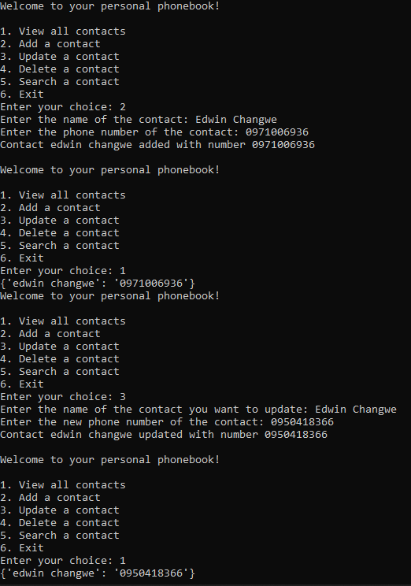

<h1 align="center">  PERSONAL PHONEBOOK </h1>

 The personal phonebook is a program that allows users to manage their personal contacts by storing, updating, deleting and searching for them. It is implemented as a class called "Phonebook" that provides several methods for performing different actions on the contacts. The class uses a dictionary called "contacts" to store the phonebook entries, where the name of the contact is used as the key and the phone number as the value.

 Users can add new contacts to the phonebook by providing a name and phone number, update an existing contact's phone number, delete a contact from the phonebook, search for a contact by name and retrieve the phone number associated with that contact, and view all the contacts stored in the phonebook. The program has a simple user interface that allows the user to interact with the phonebook through a menu of options.

 The personal phonebook is designed to be user-friendly, easy to use and intuitive. It is suitable for anyone who wants to keep track of their personal contacts in a convenient and organized way.

<h1 align="center">  About the Code </h1>

 The code  defines a class called "Phonebook" that allows users to manage their personal contacts. The class has several methods that perform different actions on the contacts: 

- 
 The __init__ method is a constructor for the class and it initializes an empty dictionary called "contacts" to store the phonebook's entries. 

- 
The add_contact method prompts the user to enter the name and phone number of a new contact, and then adds that contact to the "contacts" dictionary, with the name as the key and the number as the value. 

- 
 The update_contact method prompts the user to enter the name of an existing contact and a new phone number. If the contact is found in the "contacts" dictionary, the method updates the number associated with that contact. If the contact is not found, the method prints a message indicating that the contact was not found. 

- 
 The delete_contact method prompts the user to enter the name of an existing contact. If the contact is found in the "contacts" dictionary, the method deletes the contact from the phonebook. If the contact is not found, the method prints a message indicating that the contact was not found. 

- 
 The search_contact method prompts the user to enter the name of an existing contact. If the contact is found in the "contacts" dictionary, the method returns the phone number associated with that contact. If the contact is not found, the method returns a message indicating that the contact was not found. 

- 
 The view_contacts method returns the complete phonebook entries of the "contacts" dictionary. If the "contacts" dictionary is empty, the method returns a message indicating that no contacts were found. 

 The code also creates an instance of the Phonebook class, and enters an infinite loop that displays a menu of options for the user to interact with the phonebook. The user can choose to view all contacts, add a new contact, update an existing contact, delete a contact, search for a contact, or exit the program. Depending on the user's choice, the program calls the corresponding method of the Phonebook class. If the user enters an invalid choice, the program will print an error message and prompt the user to enter a valid choice again. 

# Screenshot

